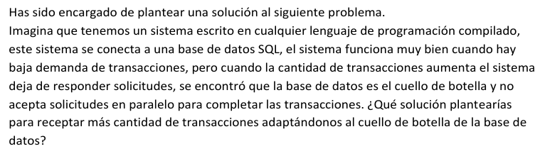
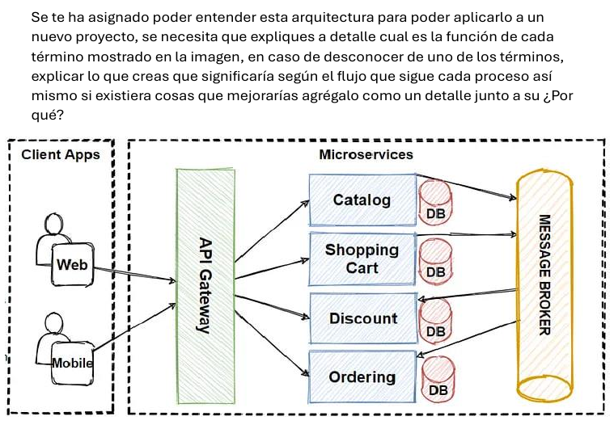
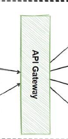
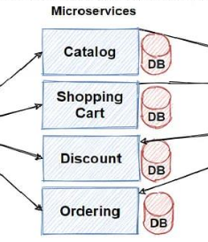
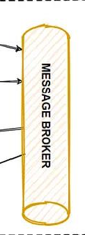

### 1. Problema de diseño

**Respuesta propuesta:**

De acuerdo a lo planteado en parte la solución depende del funcionamiento y configuraciones del sistema gestor de base de datos. Atendiendo con configuraciones de optimización propias de la base de datos ayudaría en el rendimiento de las operaciones en la base de datos.

Por la parte del código en uso siendo este de tipo compilado la solución depende de las implementaciones de los mecanismos de coordinación sea de tipo paralelo o concurrente si estos ya estan empleados en el código del sistema se tendría que revisar e investigar desde la capa de conexión hasta cada uso de la instancia de conexión y las creaciones de transacciones con las confirmaciones de los cambios solicitados.

### 4. Aprendizaje

**Explicación al entendimiento de cada parte del diagrama de la arquitectura:**

1. La parte de **Client Apps** se entiende esta relacionado al software que sirve como interfaz de uso a usuarios finales para respuesta a las interacciones del mundo exterior. Bien pueden ser como se muestra en la imagen software al que se acceda en el navegador web, software instalado como aplicación móvil, software para computadora de escritorio, etc.

2. La parte de **API Gateway** se puede interpretar como un servicio intermediario, puerto o pasarela que coordinara la comunicacion desde las aplicaciones clientes a los servicios de datos relacionados que estan de manera distribuida.

3. La parte de **Microservices** en el diagrama representa a servicios web disponibles de manera independiente bien pueden ser bajo un mismo protocolo de `http` como una JSON API por ejemplo, o algun procolo diferente diferente. Se muestra que cada uno esta de igual manera con una base de datos independiente aunque no necesariamente tenga que ser asi aunque para reducir la carga a implementar una sola instancia de base de datos puede ser recomendable el enfoque mostrado.

3. La parte de **Message Broker** se puede interpretar como un mecanismo o servicio de intercomunicación de envio y entrega mensajes de respuestas en este caso entre los microservicios.

### 5. Demostrando hallazgos

El enfoque de emplear microservicios de forma sencilla puede verse como hacer una separación de un trabajo complejo o que podria ser más complejo a áreas o espacios de trabajos especializados que reducirán la carga de trabajo y facilitaran la atención de un trabajo específico a diferencia de que todo este concentrado en un solo espacio.

Esto beneficia de las siguientes maneras:

1. En la organización del proyecto a nivel código.

2. En el trabajo o colaboración de equipos de personal técnico dada que la arquitectura está separada en partes.

3. En distribuir el consumo de recursos computacionales.

4. Poder integrar alguna tecnología nueva de manera independiente.

Lo que puede impactar principalmente de dos formas:

1. En la autonomía y conformidad del personal técnico sobre la organización del proyecto y que sea más fácil de explicar a personal no técnico.

2. En la capacidad a atención de problemas para no afectar el funcionamiento global del sistema si es de uso crítico y tratar de manera independiente la parte afectada.